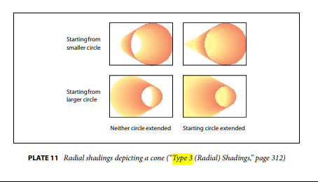
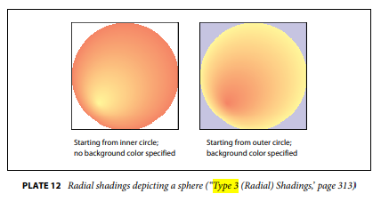

# Some Open Issues For COLR V1

## Variations

### VarF2Dot14

The COLR v1 proposal defines a VarF2Dot14 structure to allow two scalars to be variable:

* The alpha (opacity) for a colour—a fractional value in the range [0, 1].
* A relative colour stop offset along a gradient color line—a fractional value in the range [0, 1].

The problem here is that it has not yet been defined how scaled variation deltas, which are int16 values, should be combined with an F2Dot14 value. Up to OT 1.8.3, values in any table that can be variable are FWord or UFWord—coordinates or distances in the design grid. Those are always (signed or unsigned) 16-bit integers.

One possible solution is to apply scaled variation deltas as though the F2Dot14 were an FWord. (Equivalently, the scaled deltas are signed numerators of 1/16384ths added to the F2Dot14.)

### VarFixed

The COLR v1 proposal defines a VarFixed structure to allow the elements of an Affine2x2 matrix to be variable.

The problem is that it has not yet been defined how scaled variation deltas (int16s) should be applied to a Fixed value.

This problem is worse than for VarF2Dot14 since a Fixed value has signed 16-bit integer and unsigned 16-bit fractional portions.

Possible solutions:

* Variation deltas are applied only to the integer portion of a Fixed value.
* Variation deltas are applied only to the fractional portion.
* Add an additional member to VarFixed that is a static coefficient applied to the deltas, which are then interpreted as signed numerators of 1/65536ths.
* Extend the VarFixed struct to have *two* pairs of var store indices.
* Cut VarFixed: the Affine2x2 matrix elements are not variable.

### Static values when an Item Variation Store is present

Every new value in COLR v1 (modulo outcome of the VarFixed issue) is variable, with indices that reference delta sets in an Item Variation Store (IVS) subtable.

If there is no IVS subtable, then all values are static. (In this case, all delta set indices should be NULL.)

However, if there is an IVS subtable present, there is no way to distinguish between a value that is static (non-variable) versus a value that has delta-set indices (0, 0).

(This issue doesn't arise in any existing use of IVS tables because the formats for the items that *could* be varied does not have mandatory delta-set indices. For example, in a Ligature Caret List within GDEF, the caret values are not variable unless a format 3 CaretValue table is used, and the referenced Device or VariationIndex table has a deltaFormat member set to 0x8000.)

Possible solutions:

* To have a static value, the items delta-set indices must index into a delta set with only 0s as deltas.
* A variant of the previous solution, the (0, 0) delta set must always have (can be assumed to have) only 0s as deltas.
* Indices (FFFF, FFFF) are a marked case meaning *no deltas*.

## "Radial" gradient (Paint format 3)

The Google COLR v1 proposal describes Paint format 3 as a "radial" gradient. This is not the best description and could confuse readers. The concern is to make sure the intended semantics are clear to readers of the spec coming from a variety of backgrounds.

Notionally, a "radial" gradient has gradation along *rays* from an originating point. CSS [radial-gradient()](https://developer.mozilla.org/en-US/docs/Web/CSS/radial-gradient) are true *radial* gradients.

Several frameworks have "radial" gradients that allow a "focal" point to be specified separately from the circle. SVG [radialGradient](https://www.w3.org/TR/SVG11/pservers.html#RadialGradientElement), SkiaSharp [SKShader.CreateRadialGradient()](https://docs.microsoft.com/en-us/dotnet/api/skiasharp.skshader.createradialgradient?view=skiasharp-1.68.1) and Direct2D [ID2D1RadialGradientBrush](https://docs.microsoft.com/en-us/windows/win32/api/d2d1/nn-d2d1-id2d1radialgradientbrush) are examples.

The proposed format is probably best described as a *cylindrical* gradient as it involves gradation along the length of a circular cylinder defined by two circles. \

In fact, though, "conical" is a more common term for this kind of gradient than "cylindrical". "Conical" actually fits those frameworks that define "radial" gradients with a separate focal point since, if the focal point is outside the circle, then the rays of the gradient take the appearance of a cone. This is a special, limiting case of the proposed format, with one of the circles having a radius of 0.

SkiaSharp supports the proposed format and refers to it as a "two point conical gradient" ([SKShader.CreateTwoPointConicalGradient()](https://docs.microsoft.com/en-us/dotnet/api/skiasharp.skshader.createtwopointconicalgradient?view=skiasharp-1.68.1)).7 The PDF spec (archived [PDF 1.7](https://www.adobe.com/content/dam/acom/en/devnet/pdf/pdf_reference_archive/pdf_reference_1-7.pdf) is freely available—see page 310) does refer to this kind of gradient as "radial shading", but clearly states that it is used to depict three-dimensional spheres *and cones*.

Visual figures should be provided that clearly indicate the cylindrical nature of this kind of gradient. The PDF spec has pretty good explanatory illustrations.

## Extending

The proposal defines a ColorLine struct with a single extend member, with three extend moded defined. The implicit assumption is that both ends of the color line extend in the same manner; e.g., in the Extend Pad mode, the colours at the start and end boundaries are continued in the respective directions. This is comparable to the [spreadMethod](https://www.w3.org/TR/SVG11/pservers.html#LinearGradientElementSpreadMethodAttribute) attribute for gradients in SVG.

The PDF spec handles things differently: it only has one binary mode, Pad or none, but it has *two members* allowing extend behaviour to be specified separately for each end of a colour line.

The proposal could be extended to allow separate start and end extend modes. This should be considered.

If only one extend member is used, the spec should make clear what the expected behaviour is for both the start and end sides of the colour line.

## Other gradient types

There are other kinds of gradients that could potentially be supported. For example, a path gradient (like a linear gradient, but along a path defined using Bezier curves), or a mesh gradient. (The latter was brought up in discussion during a teleconf.) We need to close on what will or won't be supported.

I propose that only linear and radial/conical gradients be supported at this time.

## 32-bit glyph IDs?

This was part of the original proposal, but subsequent comments suggest a preference to stick with 16-bit glyph IDs. We just need to close on that.

Proposed: 16-bit glyph IDs.

## Blending modes

In [issue 13](https://github.com/googlefonts/colr-gradients-spec/issues/13) of the Google proposal repo, I raised the possibility of adding layer record flags to allow for different blend modes or composition operations (e.g., punch lower layers).

Do we want to consider this?

If we don't want to block on design details, we could simply add a reserved flags field to allow for future possibilities.
