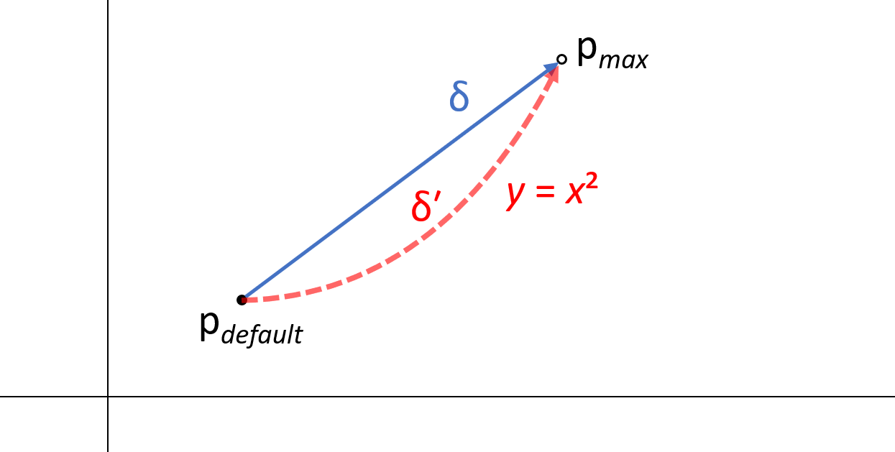

# Understanding Non-Linear Interpolation in OpenType Variable Fonts

November 16, 2020

There's been growing interest in non-linear interpolation techniques in OpenType variable fonts (NLI). The basic idea is to get glyph contour points moving along curves as a variation axis changes, rather than in straight lines. A few people have prepared articles or presentations explaining NLI, though none so far has clearly explained *why* NLI works: what it is in the OpenType table formats that makes NLI possible. This aims to explain that.

I should point out there are two separate aspects to NLI that may be of interest to people:

1. *What's the basic mechanism in the font formats that enables NLI?* (Or, *How is non-linearity even possible?*)
1. *What are practical techniques that can be used to create fonts using NLI?*

Both are valuable and important, and eventually people will want to understand both. This is only answering the first question.

This discussion will focus on variations using TrueType outlines and the 'gvar' table, rather than the CFF2 table. (I haven't yet investigated if there are any CFF2-specific details.)

## The rise of NLI and recent interest

The idea and proof of concept for NLI, or *"higher-order interpolation" (HOI)*, was first presented by Underware at [TYPO Labs 2018][1] (see the "Font Fiction" segment, starting at 23:10). They explained HOI in terms of how Bezier curves work:


"We actually see... three straight lines. And in that way, it should be possible to get this into our design space, quite easily. The thing with the higher interpolation is that, uh, perhaps how it works is a bit complex, but how you can apply it is very simple."

They went on to describe the lines used in the definition of the quadratic Bezier curve as linear variations in the design space, with three masters in which two are duplicated—a "gemowespace" (from the Greek word for 'twins').


"But you should be aware that the diagonal, from A to B, looks like a straight line, but it is a curve."

At this point, I don't think very many in the audience were thinking it was simple. 

Underware since wrote an article explaining their ideas: [*Case study: Higher Order Interpolation for Variable Fonts*][4]. They explain concepts for 2nd- and 3rd-order (quadratic and cubic) NLI, but that the technique could be extended to any order. And, in their representations of design spaces, masters are being duplicated. For instance, for 4th-order, a total of four masters are used, but some are repeated four or six times in the design space. Generalizing, for *Nth* order NLI, *N + 1* masters will be used, with some masters repeated in the design space several times (the counts follow entries in [Pascal's triangle][5]) for a total number of 2<sup>*N*</sup> masters in the design space.

Very recently, I've come across some others that have been experimenting with NLI, in some cases providing explanations or more:

* Black\[Foundry] [tweeted][11] some interesting examples of NLI.
* Stephen Nixon (ArrowType) recently [tweeted][6] about a [GitHub repo] he created with an NLI demo. Unfortunately, he removed some of the explanation he had written, but (at this time) his demo fonts are still in the repo and are informative.
* In the same Twitter thread, José Miguel Solé Bruning provided a small [video demo][7] of a smooth rotation using 2nd-order NLI, using Laurence Penney's terrific [Samsa][9] variable font inspection too to provide insights.
* Fredrick Brennan recently created a [GitHub project][2] with scripts for use with FontForge for creating fonts that use NLI techniques. He also created a [video][3] tutorial demonstrating the scripts. He provides some explanation, focused mainly on the design process and data generated by the scripts. He has good examples that show the potential of being able to get contour points varying along paths that are Bezier curves.
* Ben Wagner very recently wrote up his investigations as an explanation, [*Higher Order Interpolation of OpenType variable fonts*][10]. This has lots of math, example point coordinates and TTX dumps, so won't be the easiest for some to follow. But early on he gives a key insight: "Non-linear interpolation takes advantage of the fact that 'The overall scalar is the product of all per-axis scalars.'"

One thing that has become widely understood about NLI is that **axis tags are repeated multiple times in a font's 'fvar' table**. But some less obvious things are *why that works*, or *what the nature of the deltas or "masters" needs to be*. Some better examples are still needed to help clarify for "the rest of us".

An impression one gets from some of the explanations (certainly, from Underware's article) is that there can be a lot of duplication of masters. It can leave you wondering, *Does NLI mean that there's an explosion of data in the font? Will we end up with much larger fonts if we use NLI?* For example, in the sample HOI.ttf that Fred Brennan provides in his repo, which uses 3rd-order NLI, the four demo glyphs have either six or seven delta sets each, and that is with the axes having the same mininum and default values (so just 1/8th of the potential design space).

Depending on the design approach or tooling used, it could be possible to end up with more data in the font than is really needed. For instance, in Fred Brennan's sample, I think the number of delta sets for any glyph could be reduced to at most three, instead of six or seven. But that might not be recognized if the basic mechanism that makes NLI possible isn't understood. That's why I think it's important for that to be explained.

## The basic linearity constraint

The 'gvar' table formats and processing algorithm was designed to support linear variation. There are two key components involved here: *deltas*, and a *scalar* multiplier that gets computed based on the selected variation instance. 

Deltas are vectors. In the 'gvar' table, the individual vectors come in pairs—*(delta<sub>x</sub>, delta<sub>y</sub>)*—, and each pair defines a vector. And vectors are straight lines. A delta vector is added to the position coordinates of a point in a glyph outline, which causes the point to move in a straight-line path as the variation "user" coordinate is changed.

How *far* the outline point moves in the direction of the vector is determined by the scalar multiplier, which varies from 0.0 to 1.0. For a given axis, the scalar value is calculated by linear interpolation between two values. To simplify discussion for the moment, we can focus on variation between the axis default and axis maximum values. Thus, the scalar for an axis is computed as follows:

*axisScalar* = (*instanceCoord* - *axisDefault*) / (*axisMax* - *axisDefault*)

Note: this is an initial simiplification of the scalar calculation. Later, we'll need to be a bit more precise.

Now, this has focused on a single axis, and of course a font can have multiple axes, such as weight and width. In that case, the per-axis scalars are multiplied together. For example:

<p style="padding-left:55px; text-indent:-55px">
<em>scalar</em> = (<em>instanceCoord<sub>wght</sub></em> - <em>axisDefault<sub>wght</sub></em>) / (<em>axisMax<sub>wght</sub></em> - <em>axisDefault<sub>wght</sub></em>) <br> × (<em>instanceCoord<sub>wdth</sub></em> - <em>axisDefault<sub>wdth</sub></em>) / (<em>axisMax<sub>wdth</sub></em> - <em>axisDefault<sub>wdth</sub></em>)
</p>

Still, the effect of any given axis is linear. But we're interesting in being able to have a single axis have *non-*linear effects.

So, as designed, everything involved in variation of outlines—the deltas and the scalars—are fundamentally linear in nature.

If that's the case, how can a non-linear effect, such as a rotation, be implemented?

## Linear simulation of non-linear effects

One technique that has been known for many years is to approximate the desired curved trajectory of outline points into multiple piecewise-linear steps, and then combine multiple deltas that operate over portions over the overall axis range from default to max. David Berlow demonstrated this back in the 1990s with the TrueType GX font, Zycon. An analogy for this (though not quite accurate) is key frames in an animation.

To understand this technique, it's important to point out that the calculation of axis scalars shown above was a simplification, assuming that each scalar is computed over the range between the axis default and the max values. Some deltas work that way, but deltas can also be specified so that the apply only over a sub-range: from a starting axis coordinate, to a peak, and then to an ending coordinate. This kind of delta is known as an *intermediate*. The scalar multiplier varies over that sub-range between 0.0 at the start and end coordinates, to 1.0 at the peak coordinate.


A good way to understand this technique is to examine the Zycon font using Laurence Penney's [Samsa variable font inspector][12]: Select Zycon.ttf in the Fonts dropdown, select the clock face in the glyph panel on the right, move the M1 axis slider, and watch how the scalars for different delta sets vary.

An obvious downside of this technique is that in involves adding many additional delta sets to a font. And, in the font development process, there many be many additional "masters" to prepare.


This example helps to see the potential advantage of *non-linear* interpolation: if only it were possible, then perhaps effects like rotation could be implementated without needing a lot of delta sets.

But, again, if the deltas and scalars are inherently linear, how can non-linearity be possible?

## Creating non-linear scalar functions

We saw above that the scalar function for multiple axes simply multiplies together axis scalars that vary linearly. And, it was pointed out that, in the scalar function, the effect of any given axis is a *linear* change.

However, we haven't really be careful in clarifying what we mean by *axis*. It turns out that there are two distinct ways to view that: 

* The external API perspective: *What are the independent parameters for controlling a variable font?*
* The perspective of the interface between the 'fvar' and 'gvar' tables: *How many coordinates are used to define **regions** in the variation space over which deltas apply?*

In fact, these are distinct. And it's that distinction that makes NLI possible.

From an external API perspective, the variation space of a font is defined by the distinct axis tags specified in a font's 'fvar' table, and the min, default, and max coordinates for each tag. So, for example, if the 'fvar' table has axis records that reference only the 'wght' and 'wdth' axes, then the font has a two-dimensional variation space. 

But what if a font's 'fvar' table has axis records that repeat the same axis tag two or more times. How does that affect things for external APIs?

Potentially, external API implementations might handle this in different ways. An API *could* be designed to take a parameter array with as many arguments as there are axis records, allowing different arguments for each record even if two records have the same axis tag. While that's a possibility, the real-life APIs I'm aware of take as many input parameters as there are *distinct axis tags—in particular, taking variation instance arguments as tag-value pairs. This is true, for example, in CSS (see the [font-variation-settings][14] property), Core Text (see, for instance, [CTFontDescriptorCreateCopyWithVariation][16]), DirectWrite (see, for instance [IDWriteFontResource::CreateFontFace][15]), and Harfbuzz (see [Working with OpenType Variable Fonts][17]).

Note that this external perspective on its own doesn't determine or give any indication as to whether varitions in the 'gvar' table have linear or non-linear effects. This aspect of the data in the font's 'fvar' table only defines the input parameters for the font's variations.

The second perspective for defining "axis" is the internal interface between the 'fvar' and 'gvar' tables. Specifically, what's relevant is the way that the scalar function is defined. We've mentioned that *per-axis* scalars are calculated and then combined. But how are the axes counted? *Per 'fvar' axis records?* Or *per distinct axis tags?*

At this point, we need to get a bit more precise with a bit more detail about how scalars are calculated.

Deltas specify variation-space regions in which they apply. These regions are specified using *tuple records*, which are variation-space coordinate n-tuples. The number of coordinates—the size of the tuples—is the same as the number of axis records, not distinct axis tags. So, for instance, if a font's 'fvar' table has three axis records that use only two tags, the tuple records used to define regions will have three coordinates, not two.

The tuples used to define regions use *normalized* coordinates. The axis min, default, and max values in the 'fvar' table are relevant for external APIs, but are not used directly in scalar calculation (as was suggested above). Rather, the axis min/default/max values in the 'fvar' table determine a normalization function, and then regions and scalar calculation is done using the normalized coordinates. For now, the main thing to understand about normalized coordinates is that they range from -1 for the axis mininum, to 0 for the axis default, to +1 for the axis maximum. If we talk about deltas that apply to regions from the default to axis extremes, such as axis max, then the region would be defined by cordinates like (1) for a single-axis font, or (0, 1), (1, 0), or (1, 1) for a two-axis font.

The other key detail is that the calcuation of per-axis scalars is defined on a per-delta-set basis using the region specification for the region in which the delta applies. So, whereas earlier we can the calcuation of per-axis scalars as

*axisScalar* = (*instanceCoord* - *axisDefault*) / (*axisMax* - *axisDefault*)

this was an approximation and simplification. The following is a representative excerpt of the scalar calculation for a particular region that's more precise (adapted from [specification for the scalar calculation][13] to the wording used in the discussion here):

``` cs
    S = 1; /* initialize the overall scalar for the region to one */

    /* for each axis, calculate a per-axis scalar AS 
       in relation to the given region */  
    (for i = 0; i < axisCount; i++)
    {
        ...

        /* Calculate the per-axis scalar by linear interpolation of the
           instance coordinate in relation to the peak within the region. */

            ...

            else if (instanceCoords[i] < peakCoords[i])
            {
                AS = (instanceCoords[i] - startCoords[i])
                     / (peakCoords[i] - startCoords[i]);
            ...
            }
        /* The overall scalar is the product of all per-axis scalars. */
        S = S * AS;
    }

```

There are two key things in this. First, the per-axis scalar calculation is a linear interpolation of the normalized instance coordinates in relation to the normalized *region* coordinates. Second, the number of per-axis scalars is determined by the coordinate tuple size, which is the number of axis records, not the number of distinct axis tags.

Potentially, if an axis tag is repeated in multiple 'fvar' axis records, an implementation *might* handle scalar calculation differently, since the spec is silent about that scenario. But it seems *very unlikely* that any implementation would do so.

So, at least some implementations have input variation-instance parameters on a per-axis-tag basis, while calculating axis scalars on a per-axis-record basis. **It is this difference between the external API and internal 'fvar'/'gvar' perspectives on "axis" that introduces non-linearity in the scalar function!** Let's see how. 

For simplicity, let's consider the case of a font that uses one axis tag but has two axis records for that tag. And to keep things simple, let's suppose that the delta sets don't use "intermediates", and define regions only using the axis default and max values.

As shown above, each axis scalar is calculated by linear interpolation of the normalized instance coordinates between start and peak coordinates. Let's say the input instance coordinate for the axis is *T*. As shown above, an axis scalar, *AS<sub>t</sub>*, will be computed as:

*AS<sub>t</sub>* = (*T* - *startCoords*) / (*peakCoords* - *startCoords*)

Note that, if an axis tag is repeated in multiple axis records, the value of *T* will be the same for each per-axis scalar calculation. We can suppose the axis records would repeat the same min/default/max values as well as the tag. So if the same value is repeated for tuple coordinate that defines the region, then the calculation of *AS<sub>t</sub>* for each axis will also be the same. But if T and the region coordinates are repeated for two axis records, then we can have a combined scalar *S* as follows:

*S<sub>t</sub>* = *AS<sub>t</sub>* × *AS<sub>t</sub>* = *AS<sub>t</sub><sup>2</sup>*

Aha! Non-linearity! Instead of the scalar function being linear from 0 to 1, it can be a quadratic function, like so:


Now, the preceding paragraph skipped over a few details. Let's expand this a bit more completely by considering the regions that might be used for delta sets. We'll continue with the same example and simplifying assumptions: one axis tag repeated in two records with regions defined only using the axis default and max. Thus, regions are defined in a two-dimensional variation space, and three regions can be defined, in terms of the axis extrema and corners, as follows (using normalized coordinates):

| Region | Defining coordinates | Description |
|-|-|-|
| Region 1 | (1, 0) | max for first axis record |
| Region 2 | (0, 1) | max for second axis record |
| Region 3 | (1, 1) | corner at max for first and second axis records |

Each region can have separate delta sets. So, suppose for a given contour point there are specific deltas in each region, δ<sub>1</sub>, δ<sub>2</sub>, and δ<sub>3</sub>. The total delta applied to the contour point for a given variation instance will be the sum of these deltas with corresponding scalars applied. Note that the scalars are calculated *per region*. So, suppose the scalars for these three regions, for a given input coordinate *T*, are *S<sub>t,1</sub>*, *S<sub>t,2</sub>*, and *S<sub>t,3</sub>*.

In the case of regions 1 and 2, one of the region-defining coordinates is 0. In the more complete scalar function definition, when a region peak/max coordinate is 0, the computed axis scalar is 1. In other words, that axis has no scaling effect; it is only the other axis that contributes to the scaling. So, because of the region definitions, the combined scalars for the three regions will be:

*S<sub>t,1</sub>* = *AS<sub>t,1</sub>*  
*S<sub>t,2</sub>* = *AS<sub>t,2</sub>*  
*S<sub>t,3</sub>* = *AS<sub>t,1</sub>* × *AS<sub>t,2</sub>*

And the total delta applied to the contour point for the variation instance with input coordinate *T* will be:

δ<sub>t</sub> = δ<sub>1</sub> × *S<sub>t,1</sub>* &nbsp; + &nbsp; δ<sub>2</sub> × *S<sub>t,2</sub>* &nbsp; + &nbsp; δ<sub>3</sub> × *S<sub>t,3</sub>*

Or,

δ<sub>t</sub> = δ<sub>1</sub> × *AS<sub>t,1</sub>* &nbsp; + &nbsp; δ<sub>2</sub> × *AS<sub>t,2</sub>* &nbsp; + &nbsp; δ<sub>3</sub> × *AS<sub>t,1</sub>* × *AS<sub>t,2</sub>*

But as we saw just above, *T* is the same for both axis records, and if the axis min/default/max values in both records are also the same, then the axis scalar calculations will also be the same—in other words, *AS<sub>t,1</sub>* = *AS<sub>t,2</sub>*. So, let's generalize the scalar:

*AS<sub>t</sub>* = *AS<sub>t,1</sub>* = *AS<sub>t,2</sub>*

Thus, we arrive at the combined delta calculation as follows:

δ<sub>t</sub> = δ<sub>1</sub> × *AS<sub>t</sub>* &nbsp; + &nbsp; δ<sub>2</sub> × *AS<sub>t</sub>* &nbsp; + &nbsp; δ<sub>3</sub> × *AS<sub>t</sub>*<sup>2</sup>

Or, 

δ<sub>t</sub> = (δ<sub>1</sub> + δ<sub>2</sub>) × *AS<sub>t</sub>* &nbsp; + &nbsp; δ<sub>3</sub> × *AS<sub>t</sub>*<sup>2</sup>

OK, we have non-linear scalar functions applied to the deltas. But the deltas are still vectors—straight lines. So far, all this means is that *the rate of change* of the scaling of the deltas is not the same across the entire axis range, but the trajectory of deltas are still straight lines. What we want is for the *path along with the contour point varies* to be a curve, not a straight line. How do we do that?

This last part is easy to explain using an example. As pointed out earlier, the 'gvar' deltas actually come in X and Y delta *pairs*. We could separate the X and Y components into separate delta sets. So, for instance, suppose for a contour point, p, we want a delta to move it from it's default position p<sub>default</sub> to a different p<sub>max</sub> for the instance with the the axis max coordinate, as in the following figure. But instead of a delta that moves in a straight line, as with δ, we'd like a non-linear delta, δ′, that moves along the quadratic equation *y* = *x*<sup>2<sup>:



We can easily achieve that effect if we separate the X and Y components of delta δ into two separate deltas, call them δ<sub>1</sub> and δ<sub>3</sub>, and have them apply to regions 1 and 3 as defined above:


With δ<sub>1</sub> applied to region 1, defined by the normalized coordinate tuple (1, 0); and with δ<sub>3</sub> applied to region 3, defined by the normalized coordinate tuple (1, 1); the combined delta will be:

δ<sub>t</sub> = δ<sub>1</sub> × *AS<sub>t</sub>* &nbsp; + &nbsp; δ<sub>3</sub> × *AS<sub>t</sub>*<sup>2</sup>

Skipping a few math steps, the relationship between the X and Y components of the combined delta will be:

δ<sub>y</sub> = m × δ<sub>x</sub><sup>2</sup>

where m is a constant derived from the lengths of δ<sub>1</sub> and δ<sub>3</sub>.

So, by example, we've seen how non-linearity in the scalar calculation can be used to get, effectively a delta that follows a curved path rather than a straight line.

We've seen how we can get quadratic effects when an axis tag is repeated in two axis records. If we repeat it in a third axis record, we can get cubic effects. Let's look at a few details for the cubic case: the regions that can be defined—considering only axis default and max—would be as follows:

| Region | Defining coordinates | Description |
|-|-|-|
| Region 1 | (1, 0, 0) | max for first axis record |
| Region 2 | (0, 1, 0) | max for second axis record |
| Region 3 | (0, 0, 1) | max for third axis record |
| Region 4 | (1, 1, 0) | corner at max for first and second axis records |
| Region 5 | (1, 0, 1) | corner at max for first and third axis records |
| Region 6 | (0, 1, 1) | corner at max for second and third axis records |
| Region 7 | (1, 1, 1) | corner at max for all three records |

Suppose for each region there were delta sets, and individual deltas for a certain point, δ<sub>1</sub>, δ<sub>2</sub>, … δ<sub>7</sub>. The combined delta for an input *T*, δ<sub>t</sub>, would be:

δ<sub>t</sub> = (δ<sub>1</sub> + δ<sub>2</sub> + δ<sub>3</sub>) × *AS<sub>t</sub>* &nbsp; + &nbsp; (δ<sub>4</sub> + δ<sub>5</sub> + δ<sub>6</sub>) × *AS<sub>t</sub>*<sup>2</sup> &nbsp; + &nbsp; δ<sub>7</sub> × *AS<sub>t</sub>*<sup>3</sup>

An important thing to notice in this, and in the similar equation for the quadratic case earlier, is that there is no need to maintain separate deltas and delta sets δ<sub>1</sub> versus δ<sub>2</sub> versus δ<sub>3</sub> since they are always used with the same scalar coefficient—in other words, they are always used in equal proportions. The same applies to δ<sub>4</sub>, δ<sub>5</sub>, and δ<sub>6</sub>: they are always used in equal proportions. This means that they could be combined into a single delta. In principle, variation space needs to be three-dimensional to enable cubic non-linearity, and so all seven regions would be available; but there's no need to create delta sets for all of them.

Generalizing, for Nth-order non-linearity, an axis tag needs to be duplicated in N axis records; and there would be 2<sup>N</sup> - 1 regions (considering just axis default to max) that could be used; but so long as the axis min/default/max values are the same in all records, deltas for the same order in the scalar term (i.e., the same number of 1s in the region-defining tuple) can be combined into a single delta.

This is an important point at which the Underware presentation may mislead: by suggesting that "masters" are duplicated into multiple "corners" of the design space, this might be an easy process to use to create a font with NLI, but it might also result in ineffecient font data, if deltas that could be precombined are left separate.

The initial draft of Fred Brennan's FontForge extensions appears to succumb to this pitfall. (Presumably this will soon be fixed.) This can be seen by viewing his HOI_unmangled.ttf demo file in Samsa. (In this font, the axis records that *would* have duplicated axis tags are kept with separet tags, which helps for educational purposes.) All seven of the regions listed above for the cubic case are utilized with delta sets, but the deltas are always used in equal proportions, and so the data size could be reduced by combining these.


## Afterward

I've given an explanation of *how* NLI works, in terms of the basic data and processing used for the 'fvar' and 'gvar' tables. I've also shown some potential pitfalls of inefficient data, which are avoidable. These pitfalls might not be recognized if the core mechanism in the variation data and processing isn't understood.

I have focused on NLI in the 'gvar' table, but *not* using the CFF2 table. I haven't investigated that yet to see if there is any difference that may need explaining. So, an addendum might be added in the future.

I also have not described how best to design "masters" / deltas to best achieve non-linear effects. I gave one specific example showing how to get a point moving along the basic quadratic curve *y* = *x*<sup>2</sup>, but the solution given is only one of *many, many possible ways* to achieve exactly the same effect. Whereas Akiem Helmling said, "[How HOI] works is a bit complex", I think it's actually relatively simple, once you see how to approach it. I expect that figuring out how to design tools to be make it easy for designers to create fonts that use NLI will be much harder.

In the explanation given above, I chose to ignore "intermediate" regions. The approach being taken by others, so far, in explaining or appying NLI techniques have likewise ignored intermediates. But there's no requirement to do so. The basic concepts apply, though the permutations increase. For example, whereas the duplication of the axis in general happens in the 'fvar' axis records, intermediate subranges are defined solely as delta sets are defined. So, while an axis tag might be repeated, say, three times in axis records, it's a completely separate matter whether an intermediate subrange is repeated in multiple axes in the defintion of any delta-set regions. Such duplication would be needed to create non-linearity in relation to that sub-range.

Also, I made a simplifying assumption that axis records that duplicate an axis tag also duplicate the axis min, default and max values. But potentially, these values could differ in the records that have the same axis tag. This could potentially be useful, though exploring that would require more discussion. This would likely have implications for what should be stated or constrained in the OT spec, so it certainly warrants discussion. It might also be useful to investigate whether manipulating the axis record values in that way would be equvalent to manipulating deltas in certain ways, or equivalent to manipulating intermediates in certain ways.

In math terms, the scalar function is what is known as a *basis function*; the deltas are coefficients applied to the basis functions, and the separate delta sets correspond to terms in a summation. (See discussions of Fourier series for comparison.) As seen, the linearity contraint is in how the basis function is defined, using only linear interpolations, but NLI exploits some coincidental details in the format to get axis scalars multiplied into themselves, effectively creating polynomial basis functions of 2nd-, 3rd- or higher orders. It remains to be see how difficult this is to work with for designers in practice. But in a future extension of the OT spec, a different possibility would be to enable non-linear basis functions for scalar calculation directly, without needing to duplicated axis tags in multiple axis records. For instance, Raph Levien discusses the idea of using radial basis functions in a [short video][18] and linked paper. While the current NLI techniques may be workable now, there may be significant benefits for designers if alternate, and non-linear basis functions could be supported directly.

[1]: https://www.typotalks.com/videos/export-future/
[2]: https://github.com/ctrlcctrlv/FontForge-Higher-Order-Interpolation
[3]: https://www.youtube.com/watch?v=m5z4sDECCGA
[4]: https://underware.nl/case-studies/hoi/
[5]: https://en.wikipedia.org/wiki/Pascal%27s_triangle
[6]: https://twitter.com/ArrowType/status/1325648820101853184?s=20
[7]: https://github.com/arrowtype/NLI-test
[8]: https://twitter.com/jmsoleb/status/1325782542189010950?s=20
[9]: https://lorp.github.io/samsa/src/samsa-gui.html
[10]: https://bungeman.github.io/hoi.html
[11]: https://twitter.com/blackfoundry/status/1325201254964883456
[12]: https://lorp.github.io/samsa/src/samsa-gui.html
[13]: https://docs.microsoft.com/en-us/typography/opentype/spec/otvaroverview#algorithm-for-interpolation-of-instance-values
[14]: https://www.w3.org/TR/css-fonts-4/#propdef-font-variation-settings
[15]: https://docs.microsoft.com/en-us/windows/win32/api/dwrite_3/nf-dwrite_3-idwritefontresource-createfontface
[16]: https://developer.apple.com/documentation/coretext/1508650-ctfontdescriptorcreatecopywithva
[17]: https://harfbuzz.github.io/fonts-and-faces-variable.html
[18]: https://www.youtube.com/watch?v=MUx9Rh-loqU&t=131s
